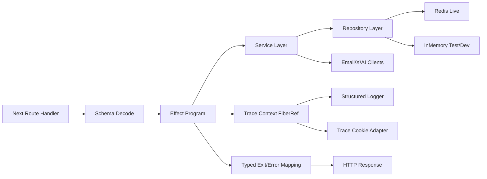

# API Modernization Input Review: Effect Migration

Date: 2026-03-12
Status: archived
Type: input-review
Audience: engineering team
Topic: api-modernization
Canonical: no
Superseded by: ../principal-engineer-roadmap-A.md

## Archived Input

This document is preserved as a contributor review input. The canonical
implementation-facing direction for this topic is
[principal-engineer-roadmap-A.md](../principal-engineer-roadmap-A.md).

## Scope

This review covers the API surface in `apps/www/app/api/*` and the shared server helpers under `apps/www/lib/*`, with emphasis on three goals:

1. Adopt an `Effect`-based execution model.
2. Build a comprehensive automated test suite.
3. Add a cookie-enabled logging and trace mechanism so clients can inspect success and error flow plus selected request state.

## Highest Priority Findings

### 1. Public chat route accepts arbitrary model identifiers from the client

Files:
- `apps/www/app/api/chat/route.ts`
- `apps/www/lib/chat/models.ts`

What is happening:
- The UI exposes a small client-side allowlist in `lib/chat/models.ts`.
- The server route trusts `model` from `req.json()` and passes it directly to `gateway(model)`.

Why this matters:
- Any client can bypass the UI list and request a different model.
- That weakens cost control, reliability, and future policy enforcement.
- It also makes a typed error model harder, because model selection is not validated at the boundary.

Evidence:
- `apps/www/app/api/chat/route.ts:221`
- `apps/www/app/api/chat/route.ts:269`
- `apps/www/lib/chat/models.ts:1`

### 2. X OAuth bootstrap relies on a query-string secret

File:
- `apps/www/app/api/x/auth/route.ts`

What is happening:
- `/api/x/auth` reads `secret` from the URL query string and compares it with `X_OWNER_SECRET`.

Why this matters:
- Query-string secrets leak into browser history, reverse-proxy logs, analytics, screenshots, and copied URLs.
- This is a privileged owner-only route, so the transport mechanism should be treated as sensitive.

Evidence:
- `apps/www/app/api/x/auth/route.ts:10`
- `apps/www/app/api/x/auth/route.ts:12`
- `apps/www/app/api/x/auth/route.ts:14`

### 3. In-memory fallback breaks parity with production storage semantics

Files:
- `apps/www/lib/redis.ts`
- `apps/www/app/api/clicks/route.ts`
- `apps/www/app/api/views/route.ts`

What is happening:
- The local fallback uses one shared `Map<string, number>` for everything.
- Click counts and page views therefore share the same key space when Redis is absent.
- In production they are stored separately.

Why this matters:
- Local behavior is not a faithful model of production behavior.
- Key collisions can corrupt counts.
- This makes test expectations unstable because the fallback repository is not domain-isolated.

Evidence:
- `apps/www/lib/redis.ts:3`
- `apps/www/lib/redis.ts:23`
- `apps/www/app/api/clicks/route.ts:5`
- `apps/www/app/api/clicks/route.ts:56`
- `apps/www/app/api/views/route.ts:27`
- `apps/www/app/api/views/route.ts:49`

### 4. View deduplication cookie does not implement per-page 24-hour semantics and will not scale

File:
- `apps/www/app/api/views/route.ts`

What is happening:
- The cookie stores only a string array of slugs.
- Every new view resets the cookie TTL for the whole array.
- No per-slug timestamps are stored.
- The array is capped by item count, not byte size.

Why this matters:
- "24 hours per page" is not what the implementation actually does.
- A page can remain deduplicated for longer than 24 hours if the cookie gets refreshed by later views.
- Long slugs will eventually push the cookie toward browser size limits and cause silent failure.

Evidence:
- `apps/www/app/api/views/route.ts:100`
- `apps/www/app/api/views/route.ts:125`
- `apps/www/app/api/views/route.ts:139`
- `apps/www/app/api/views/route.ts:155`

### 5. Bookmarks API serves fixture data whenever credentials are missing, including non-local environments

File:
- `apps/www/app/api/x/bookmarks/route.ts`

What is happening:
- Missing `X_OWNER_USER_ID` causes the route to return fake data unconditionally.
- The comment says localhost development, but the behavior is not environment-gated.

Why this matters:
- A production misconfiguration will look "healthy" while serving fake content.
- That weakens monitoring and incident detection.

Evidence:
- `apps/www/app/api/x/bookmarks/route.ts:15`
- `apps/www/app/api/x/bookmarks/route.ts:16`
- `apps/www/app/api/x/bookmarks/route.ts:17`

### 6. Contact and feedback routes interpolate raw user input into HTML email bodies

Files:
- `apps/www/app/api/contact/route.ts`
- `apps/www/app/api/feedback/route.ts`

What is happening:
- User-controlled `name`, `email`, `page`, and `message` values are injected into HTML strings with no escaping.

Why this matters:
- This is an injection surface in email clients and internal tooling that renders the HTML body.
- It also blocks any safe trace replay UI unless the payload is normalized and redacted first.

Evidence:
- `apps/www/app/api/contact/route.ts:17`
- `apps/www/app/api/contact/route.ts:23`
- `apps/www/app/api/feedback/route.ts:27`
- `apps/www/app/api/feedback/route.ts:32`

### 7. The API has no runtime contract layer and effectively no automated test baseline

Files:
- `package.json`
- `turbo.json`
- `apps/www/package.json`

What is happening:
- Root `test` delegates to `turbo test`.
- `apps/www/package.json` does not define a `test` script.
- There are no repo test files under `apps/`, `packages/`, or `.github/` outside dependencies.
- Request bodies are parsed ad hoc in route handlers instead of via shared schemas.

Why this matters:
- A migration to `Effect` without a test harness will be high-risk.
- Validation, error rendering, and storage fallbacks cannot be refactored safely.

Evidence:
- `package.json:5`
- `package.json:10`
- `turbo.json:31`
- `apps/www/package.json:5`
- `apps/www/package.json:12`

## Current Debt Matrix

| Concern | Current state | Debt level | Why it blocks your goals |
| --- | --- | --- | --- |
| Request validation | Hand-rolled `if` checks | High | No explicit contracts for `Effect` programs or property tests |
| Error model | Exceptions plus `console.error` | High | Cannot inspect typed failure paths or compose failures |
| Dependency management | Hidden imports and env access | High | Makes `Layer` adoption harder |
| Observability | Unstructured logs | High | No request-scoped trace story |
| Cookie state model | Purpose-built for views only | High | Cannot carry generic trace/debug context safely |
| Testability | No package-level test runner in app | High | No refactor safety net |
| Module boundaries | Mixed route, service, and infrastructure concerns | Medium-High | Hard to document and reason about regions/effects |
| Docs | Partial route comments only | Medium | Structure is not discoverable from reading modules |

## Target Architecture



### Recommended module boundaries

- `app/api/**/route.ts`
  Purpose: thin Next.js adapters only.
  Allowed concerns: request/response plumbing, calling one exported handler program, mapping `Exit` to HTTP.

- `lib/server/contracts/**`
  Purpose: `Schema` definitions for request, response, cookie, and trace payloads.

- `lib/server/errors/**`
  Purpose: tagged domain and infrastructure error types.

- `lib/server/runtime/**`
  Purpose: request context, tracing, logger setup, cookie helpers, config access, route runner.

- `lib/server/services/**`
  Purpose: business logic programs expressed as `Effect`s.

- `lib/server/repos/**`
  Purpose: Redis and in-memory repositories behind shared interfaces.

- `lib/server/adapters/**`
  Purpose: bridge modules for Resend, AI Gateway, GitHub, and X.

## Module Docstring Standard

Every non-trivial server module should start with a docstring that explains the program in operational terms, not just the file name.

Recommended template:

```ts
/**
 * Module: views/service
 *
 * Responsibility:
 *   Deduplicate and increment page views.
 *
 * Public API:
 *   - trackView(input): Effect<ViewResult, ViewError, ViewsEnv>
 *   - getViewCount(slug): Effect<number, ViewError, ViewsEnv>
 *
 * Dependencies:
 *   - ViewsRepo
 *   - Clock
 *   - TraceLog
 *   - Cookies
 *
 * Regions:
 *   - views.decode
 *   - views.read-cookie
 *   - views.check-duplicate
 *   - views.increment
 *   - views.write-cookie
 *
 * Failure model:
 *   - InvalidSlug
 *   - CookieDecodeError
 *   - StorageUnavailable
 *
 * Observability:
 *   Emits structured events with requestId, traceId, region, outcome, slug.
 */
```

### Why this matters

- It gives readers the program shape before they parse code.
- It makes "regions" explicit, which directly supports trace logging.
- It forces each module to declare dependencies and failure channels.
- It becomes the checklist for tests.

## Effect Abstractions to Adopt

Recommended core abstractions:

- `Effect`
  Use for all business programs and side-effectful orchestration.

- `Schema`
  Use for request, response, cookie, and trace payload contracts.

- `Layer`
  Use to assemble live and test implementations of repos, clients, config, and tracing.

- `Context` tags
  Use to declare dependencies instead of importing concrete services directly.

- `Cause`
  Use to preserve structured failure details for logs and debug traces.

- `FiberRef`
  Use for request-scoped context such as `requestId`, `traceId`, `regionStack`, and debug flags.

- logging and tracing support from `Effect`
  Use spans/annotations to record region transitions and outcomes.

Supporting utilities worth adopting:

- `Config` for environment decoding
- `Redacted` for secrets in config and logs
- `Exit` for final success or failure mapping at the route boundary

## Cookie-Enabled Trace Design

The cookie should not be the primary log store. It should be the client-visible handle and opt-in channel.

### Recommended design

Use a hybrid model:

1. `cc_trace` cookie
   Stores a signed trace session id plus debug flags.

2. server-side trace buffer
   Stores structured trace events keyed by trace session id with a short TTL.

3. optional `cc_trace_preview` cookie
   Stores a compressed and signed rolling breadcrumb summary of the last few regions for immediate client display.

### Event shape

```ts
type TraceEvent = {
  traceId: string;
  requestId: string;
  route: string;
  region: string;
  outcome: "success" | "failure";
  startedAt: number;
  endedAt: number;
  errorTag?: string;
  annotations: Record<string, string | number | boolean>;
};
```

### Region strategy

Use stable dotted region names:

- `chat.decode`
- `chat.build-prompt`
- `chat.fetch-github`
- `chat.stream-response`
- `views.read-cookie`
- `views.persist-count`
- `x.oauth.exchange`
- `contact.send-email`

### Data safety rules

- Never put secrets, tokens, raw prompts, or raw email bodies into cookies.
- Never put stack traces into cookies.
- Redact user input before trace persistence unless explicitly debug-approved.
- Keep cookie payloads versioned and byte-budgeted.
- Make trace cookies opt-in, not default-on, in production.

## Solution Options

### Option A. Minimal Effect Core behind existing routes

Description:
- Keep all route files in place.
- Introduce `Effect` only in service and repository modules.
- Use route-local adapters for request parsing and response mapping.

Pros:
- Lowest migration cost.
- Minimal disruption to current Next.js routing.
- Good first step for `views`, `clicks`, `contact`, and `feedback`.

Cons:
- Route files still own too much ceremony.
- Error mapping and request context patterns may drift between routes.
- Observability remains partially duplicated until a second pass.

Best when:
- You want fast risk reduction without major package moves.

### Option B. Effect-first server core with thin Next adapters

Description:
- Create a shared server runtime with `Schema`, `Layer`, typed errors, request context, and route runner helpers.
- All route handlers become thin adapters.
- Cookie trace, structured logging, and test harness are centralized.

Pros:
- Best balance of rigor, migration cost, and maintainability.
- Makes request regions, failures, and dependencies explicit.
- Gives you one pattern for every route.

Cons:
- Requires a modest architecture pass before feature work speeds up.
- Team needs to learn `Layer` and typed failure discipline.

Best when:
- You want the API to become a coherent subsystem rather than a set of handlers.

### Option C. Full Effect platform API package

Description:
- Move server logic into a dedicated package such as `packages/api-core`.
- Consider `@effect/platform` APIs more broadly and make the app route handlers pure adapters into that package.

Pros:
- Strongest boundaries.
- Best long-term reuse if another app, worker, or CLI will share the API logic.
- Cleanest monorepo story.

Cons:
- Highest initial cost.
- More packaging, build, and boundary work than the current repo strictly needs.
- Too much ceremony if `apps/www` remains the only consumer.

Best when:
- You expect the API logic to be reused outside this app or want hard package boundaries.

## Option Comparison

| Option | Migration cost | Architectural payoff | Testability | Observability quality | Recommendation |
| --- | --- | --- | --- | --- | --- |
| A. Minimal effect core | Low | Medium | Medium | Medium | Good short-term patch path |
| B. Effect-first server core | Medium | High | High | High | Recommended |
| C. Dedicated API package | High | Very high | Very high | High | Only if reuse/boundaries justify it |

## Recommended Plan

### Phase 0. Stabilize the boundary

Deliverables:
- Add server-side request allowlists and schemas for every route.
- Fix the high-risk issues before the larger migration:
  - validate chat models server-side
  - remove query-string secret from X auth bootstrap
  - split local storage fallbacks by domain
  - replace fake bookmark data with explicit non-production gating
  - escape or sanitize HTML email content

### Phase 1. Create the Effect server runtime

Deliverables:
- Add `effect`.
- Add `@effect/platform` only where needed.
- Add a shared route runner that:
  - decodes input
  - installs request context
  - runs an `Effect`
  - maps `Exit` to `NextResponse`
- Add `contracts`, `errors`, `runtime`, `services`, and `repos` folders.

Success criteria:
- One simple route, ideally `/api/views`, is fully migrated.

### Phase 2. Introduce request-scoped tracing and cookies

Deliverables:
- Define `TraceContext` and `TraceEvent` schemas.
- Add a `FiberRef` for request metadata and region stack.
- Add helpers like `withRegion("views.increment")`.
- Add signed trace cookie support and a Redis-backed trace buffer.

Success criteria:
- A client can opt into debug tracing and retrieve a structured event timeline for a request.

### Phase 3. Build the testing foundation

Deliverables:
- Add package-level `test` scripts.
- Add `vitest`.
- Add `@effect/vitest`.
- Add `fast-check` for property tests.
- Add repository contract tests that run against both Redis and in-memory layers.

Success criteria:
- `pnpm test --filter www` runs locally and in CI.

### Phase 4. Migrate easy routes first

Order:
1. `/api/views`
2. `/api/clicks`
3. `/api/contact`
4. `/api/feedback`

Why:
- These routes have simpler IO and will establish the house style.

### Phase 5. Migrate X integration

Deliverables:
- Typed OAuth errors
- token storage service
- bookmark repository and cache layers
- explicit live-vs-dev behavior

Why:
- X currently mixes bootstrap, state storage, external IO, and fallbacks in route files.

### Phase 6. Migrate the chat route last

Deliverables:
- validated model selection
- typed request contract
- prompt construction service
- gateway client adapter
- trace regions around GitHub fetch, prompt build, and stream startup

Why:
- Streaming and external model routing make chat the most operationally sensitive route.

## Testing Strategy

### Test layers

1. Contract tests
   Verify `Schema` decoding and encoding for requests, responses, cookies, and trace payloads.

2. Service tests
   Run `Effect` programs with test layers and assert on `Exit`, logs, and emitted trace events.

3. Repository contract tests
   Run the same test suite against:
   - Redis-backed implementations
   - in-memory implementations

4. Route adapter tests
   Assert that `NextRequest` to `NextResponse` mapping preserves status codes, cookies, and JSON payloads.

5. Property tests
   Use `fast-check` for:
   - cookie encode/decode round trips
   - slug validation
   - click tally aggregation
   - trace breadcrumb compaction

6. End-to-end smoke tests
   Cover the public user paths that matter:
   - page views increment
   - click counts flush
   - contact submission
   - feedback submission
   - bookmarks auth flow if credentials exist

### Test runner plan

Because this is a Turborepo, add package tasks instead of inventing root-only logic.

Recommended scripts in `apps/www/package.json`:

```json
{
  "scripts": {
    "test": "vitest run",
    "test:watch": "vitest",
    "test:coverage": "vitest run --coverage"
  }
}
```

Recommended `turbo.json` expectations:

- keep `test` as a package task
- cache test results only if coverage artifacts and env inputs are declared intentionally
- keep app and package test scripts independent

## Suggested Initial Module Layout

```text
apps/www/lib/server/
  contracts/
    chat.ts
    clicks.ts
    contact.ts
    feedback.ts
    tracing.ts
    views.ts
    x.ts
  errors/
    api-errors.ts
  runtime/
    config.ts
    request-context.ts
    route-runner.ts
    trace-cookie.ts
    trace-log.ts
  repos/
    clicks-repo.ts
    traces-repo.ts
    views-repo.ts
    x-token-repo.ts
  services/
    chat-service.ts
    clicks-service.ts
    contact-service.ts
    feedback-service.ts
    views-service.ts
    x-auth-service.ts
    x-bookmarks-service.ts
```

## Concrete First Sprint

Recommended first sprint scope:

1. Add test tooling and package scripts.
2. Add `effect` plus shared runtime folders.
3. Migrate `/api/views`.
4. Implement signed trace cookie plus server-side trace buffer for `/api/views`.
5. Add:
   - schema tests
   - service tests
   - route adapter tests
   - property tests for dedupe cookies

This is the smallest slice that proves all three goals together:

- `Effect` adoption
- real automated tests
- client-visible trace logging

## References

Official Effect documentation used to shape this plan:

- `Effect` docs: https://effect.website/
- `Layer`: https://effect-ts.github.io/effect/effect/Layer.ts.html
- `Schema`: https://effect-ts.github.io/effect/effect/Schema.ts.html
- `Tracer`: https://effect-ts.github.io/effect/effect/Tracer.ts.html
- `@effect/platform` `HttpApi`: https://effect-ts.github.io/effect/platform/HttpApi.ts.html
- `@effect/vitest`: https://effect-ts.github.io/effect/vitest/index.ts.html
